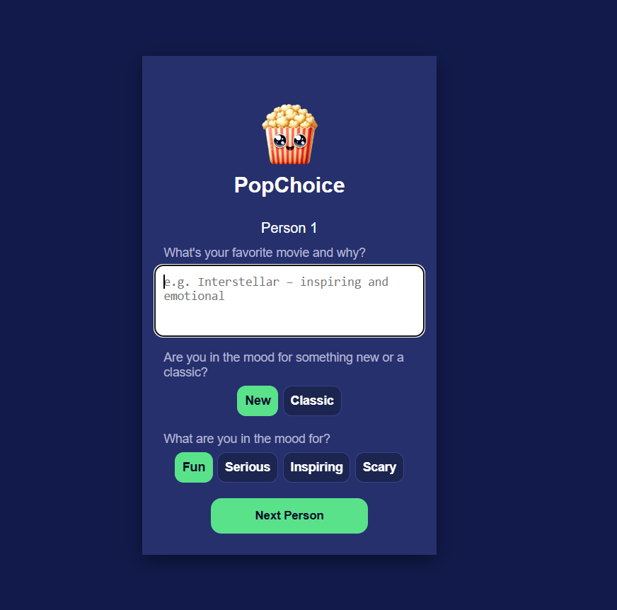
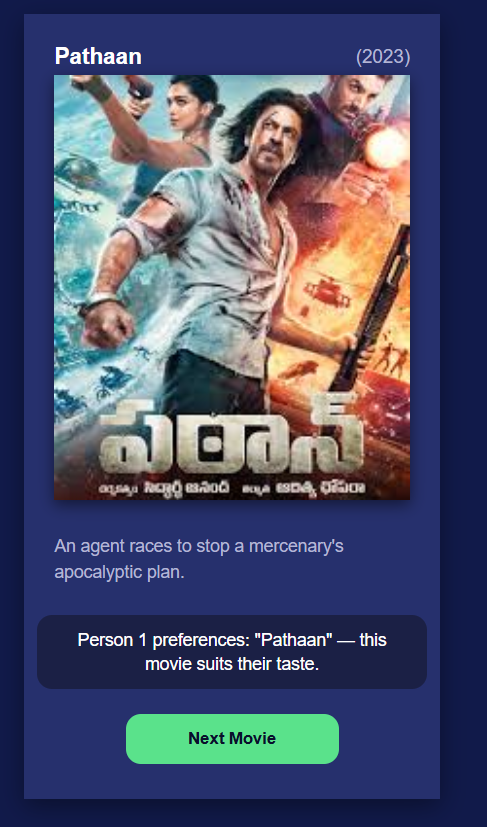

# PopChoice 🎬

PopChoice is a fun movie recommendation web app built with HTML, CSS, and JavaScript.  
It allows multiple people to answer quick mood-based questions and then suggests a suitable movie for each person.

---

## 🚀 Live Demo
[Click here to try PopChoice](https://marziahashimi.github.io/popchoice-app/)

---

## Screenshots

### Questions View

### Movie Output View

💡 Reflection

Working on this project was an exciting learning experience.
I faced challenges while setting up Supabase because it was totally new for me, but I learned how to connect it with my JavaScript frontend and manage data securely.
I also learned to use environment variables (.env) and .gitignore to keep secret keys safe.

This project helped me understand how frontend logic, databases, and APIs work together in real-world applications.
